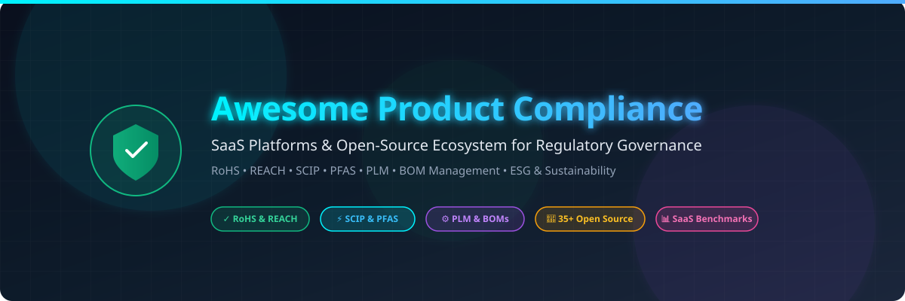

# 🛡️ Awesome Product Compliance

  

### 🌐 Curated Directory of SaaS Platforms & Open-Source Software Ecosystem
**Focused on Product Regulatory Compliance, RoHS, REACH, SCIP, PFAS, TSCA, Sustainability, Quality, Materials Compliance, BOMs & Product Lifecycle Governance**

  
  
  
  
  
  

*Last updated: September 2026*

---

## 📖 Overview

**Awesome Product Compliance** is an enterprise-grade, community-driven curated directory tracking notable commercial **SaaS/Hosted Platforms** and **Open-Source Software Projects** engineered for **Product Regulatory Compliance Management**, **Product Lifecycle Management (PLM)**, and **Supply Chain ESG Governance**.

These systems empower manufacturers, hardware engineering teams, quality managers, and regulatory professionals to orchestrate compliance declarations, chemical thresholds (**RoHS**, **REACH**, **PFAS**, **TSCA**, **EU SCIP**), environmental impact footprints (**LCA**, **CSRD**), technical files, engineering change orders (ECOs), Bills of Materials (BOMs), and immutable audit trails.

---

## 📑 Table of Contents

- [🏢 SaaS & Hosted Platforms](#-saashosted-platforms)
  - [📊 Market Size & Industry Dynamics](#-market-size--industry-dynamics)
  - [📋 SaaS Comparison Table](#-saas-comparison-table)
- [🔓 Open-Source GitHub Projects](#-open-source-github-projects)
  - [🏆 Top Open-Source Projects (Ranked by Stars)](#-top-open-source-projects-ranked-by-stars)
  - [🧩 Architectural Category Breakdown](#-architectural-category-breakdown)
- [🤝 How to Contribute](#-how-to-contribute)
- [📈 Star History](#-star-history)
- [⚠️ Disclaimer](#-disclaimer)

---

## 🏢 SaaS/Hosted Platforms

### 📊 Market Size & Industry Dynamics

> 💡 **Market Size & Sector Structure**: The Global Product Regulatory Compliance and Engineering PLM Software market is estimated at **$10.8 Billion in 2026** (projected to reach **$18.4 Billion by 2032** at an **8.9% CAGR**). The sector is **moderately fragmented**: while massive diversified enterprise infrastructure conglomerates (Oracle, SAP, Siemens, Dassault Systèmes, PTC) command core enterprise PLM and ERP backbones, specialized regulatory compliance, supplier chemical surveillance, and medical/EHS intelligence platforms (Assent, Greenlight Guru, Sphera, ComplianceQuest, Specright) retain resilient, highly specialized domain moats rather than exhibiting a winner-take-all monopoly.

### 📋 SaaS Comparison Table

*The table below is sorted by **Company Size (Market Cap / Valuation / Revenue)** in descending order.*

| 🏢 Product | 💼 Company Size (Market Cap / Valuation / Revenue) | 📝 Description | 💰 Starting Pricing | 🎁 Free Tier / Free Trial Limits |
| :--- | :--- | :--- | :--- | :--- |
| **Oracle Product Lifecycle Management** | **~$420B Market Cap** (~$53B Annual Revenue) | Enterprise PLM and cloud compliance governance for managing product records, specifications, change management, and regulatory quality lifecycles. | Starts at $175/user/month (Oracle Cloud PLM base user license, billed annually) | 30-day Oracle Cloud Free Tier trial with $300 in free cloud credits |
| **SAP Product Compliance** | **~$260B Market Cap** (~$34B Annual Revenue) | Comprehensive enterprise product compliance managing regulated substances, dangerous goods classification, SDS authoring, and supply chain declarations within SAP S/4HANA. | Starts at $3,500/month (~$42,000/year entry module in SAP S/4HANA Cloud) | 30-day SAP S/4HANA Cloud guided trial with sample master data and pre-defined compliance scenarios |
| **Siemens Teamcenter** | **~$165B Market Cap** (~$80B Annual Revenue, Parent) | Leading digital lifecycle management platform supporting complex product structures, material compliance, environmental product declarations, and change governance. | Starts at $165/user/month (Teamcenter X Essentials tier, billed annually) | 30-day free cloud trial (Teamcenter X 30-day test drive with sample CAD data and pre-configured workflows) |
| **Dassault Systèmes ENOVIA** | **~$55B Market Cap** (~$6.5B Annual Revenue) | 3DEXPERIENCE platform connecting design, BOMs, materials compliance, regulatory deliverables, and engineering configuration processes. | Starts at $150/user/month (~$1,800/user/year for Collaborative Industry Innovator role on 3DEXPERIENCE Cloud) | 14-day cloud trial sandbox of the 3DEXPERIENCE platform with demo project workspace |
| **PTC Windchill** | **~$22B Market Cap** (~$2.2B Annual Revenue) | Enterprise PLM platform engineered for digital thread traceability, BOM governance, environmental compliance (RoHS/REACH), and change workflows. | Starts at $100/user/month ($1,200/user/year standard viewer/editor tier in Windchill Cloud) | 14-day free cloud evaluation trial for qualified teams with sample BOM and CAD models |
| **Arena PLM** | **~$22B Parent Market Cap** ($715M Acquisition Valuation) | Cloud-native PLM and quality management platform unifying product records, BOM management, supplier compliance declarations, and ECO workflows. | Starts at $89/user/month (billed annually, ~$1,068/user/year with ~$10,000/year base entry tier) | 14-day hands-on guided sandbox trial for qualified engineering teams |
| **UL 360** | **~$11B Market Cap** (~$2.8B Annual Revenue) | Enterprise ESG, sustainability, EHS, and chemical compliance platform from UL Solutions for supply chain environmental reporting and regulatory tracking. | Starts at $12,000/year entry tier for mid-market compliance and ESG data management | 14-day pilot evaluation sandbox trial upon sales verification with sample facility data |
| **Lectra Kubix Link PLM** | **~$1.2B Market Cap** (~$550M Annual Revenue) | Cloud product lifecycle and product data platform specialized in materials compliance, fashion/textile regulations, supplier collaboration, and technical packs. | Starts at €75/user/month (~$82/user/month, approx. €9,000/year entry deployment) | 14-day guided trial sandbox for qualified enterprise teams with demo material libraries |
| **Sphera** | **$1.4B Valuation** (~$200M+ Annual Revenue, Blackstone) | Environmental, health, safety, sustainability, and product stewardship platform specialized in chemical regulatory compliance, IMDS, and ESG reporting. | Starts at $15,000/year base product stewardship and compliance management tier | 14-day proof-of-concept trial with pre-loaded regulatory and chemical compliance datasets |
| **MasterControl** | **$1.3B Valuation** (~$120M+ ARR Unicorn) | Enterprise quality management system (QMS) and manufacturing execution software for life sciences and regulated product compliance documentation. | Starts at $25,000/year for core quality and document management suite | 14-day guided proof-of-concept sandbox trial for qualified organizations |
| **Assent** | **$1.0B+ Valuation** (~$100M+ ARR Unicorn) | Deep supply chain sustainability and product compliance platform focused on RoHS, REACH, PFAS, TSCA, EU SCIP, and conflict minerals surveillance. | Starts at $15,000/year (~$1,250/month) entry tier | 14-day guided proof-of-concept / sandbox trial upon sales qualification with test data limits (up to 50 supplier parts/requests) |
| **Greenlight Guru** | **~$450M Valuation** (~$50M+ ARR) | Cloud QMS and product lifecycle platform purpose-built for medical device manufacturers, covering design controls, risk management (ISO 14971), and CAPA. | Starts at $1,000/month (billed annually at $12,000/year for Core QMS) | 14-day guided sandbox trial upon demonstration request with pre-configured medical device templates |
| **Aras Innovator** | **~$400M Valuation** (~$50M+ Annual Revenue) | Resilient enterprise digital thread and PLM platform supporting complex configuration, requirements, materials compliance, and engineering change management. | Starts at $1,000/subscriber/year for Enterprise SaaS subscription ($0 for Community edition) | Free forever Community edition (full self-hosted core PLM features without subscriber security updates or enterprise connectors); 30-day trial for Enterprise SaaS |
| **ComplianceQuest** | **~$180M Valuation** (~$30M+ Annual Revenue) | Salesforce-native enterprise quality, safety, risk, and regulatory compliance platform connecting suppliers, manufacturing, and customer quality workflows. | Starts at $30/user/month ($360/user/year, typically $10,000/year base minimum) | 14-day interactive trial environment with sample QMS workflows and up to 5 user logins |
| **Enhesa** | **~$160M Valuation** (~$30M+ Annual Revenue) | Global regulatory intelligence and compliance software platform providing real-time tracking of chemical restrictions, EHS rules, and product laws worldwide. | Starts at $5,000/year for regional regulatory monitoring and intelligence tier | 14-day free trial limited to 3 regulatory jurisdictions and preview compliance alerts |
| **Specright** | **~$140M Valuation** (~$25M+ ARR) | Specification data management (SDM) platform centralizing packaging, raw material, ingredients, supplier certifications, and sustainability metrics. | Starts at $10,000/year (Foundations tier for basic specification and packaging management) | 14-day interactive test sandbox trial upon request with sample specification templates |
| **Centric Software** | **~$130M Valuation** (~$60M+ Annual Revenue) | PLM platform tailored for consumer packaged goods, cosmetics, fashion, retail, and food industries managing formulations, labeling, and regulatory declarations. | Starts at $75/user/month (Centric SMB starter tier, typically from $9,000/year) | 14-day guided proof-of-concept sandbox demo with sample consumer product catalog |
| **Propel** | **~$120M Valuation** (~$20M+ ARR) | Modern Salesforce-native PLM, QMS, and PIM platform empowering commercialization, engineering change management, and regulatory compliance records. | Starts at $18,975/year (SMB starter pack for up to 5 users, ~$315/user/month) | 14-day test drive / sandbox trial on Salesforce AppExchange with demo product dataset |
| **OpenBOM** | **~$25M Valuation** (~$5M ARR) | Cloud-native collaborative BOM, inventory, and engineering change platform connecting CAD, PDM, procurement, and materials compliance tracking. | Starts at $30/seat/month (Team tier, billed annually; $90/seat/month for Company tier) | Free forever non-commercial plan limited to 1 user and up to 2,000 data records; 14-day free trial for paid commercial tiers |

---

## 🔓 Open-Source GitHub Projects

Open-source tools offer transparency, local data ownership, and customizable rule validation for engineering and compliance teams building sovereign product compliance systems.

### 🏆 Top Open-Source Projects (Ranked by Stars)

*The list below is sorted by **GitHub_Stars** in descending order. Each repository includes a dynamic social star badge linking directly to its stargazers page.*

1. ⚡ **[n8n](https://github.com/n8n-io/n8n)**   
   *Fair-code workflow automation platform connecting ERP, PLM, supplier APIs, compliance databases, and webhook triggers.*

2. 📊 **[NocoDB](https://github.com/nocodb/nocodb)**   
   *Open-source Airtable alternative turning SQL databases into collaborative compliance, materials, and certification registers.*

3. 🏢 **[Odoo Community](https://github.com/odoo/odoo)**   
   *Enterprise open-source ERP with manufacturing, multi-level BOMs, supply chain tracking, and compliance document management.*

4. 🔄 **[Apache Airflow](https://github.com/apache/airflow)**   
   *Workflow orchestration platform to automate supplier-data pipelines, regulatory ingestion, and recurring compliance validation jobs.*

5. 📄 **[Paperless-ngx](https://github.com/paperless-ngx/paperless-ngx)**   
   *Document management system with OCR scanning and indexing for supplier declarations, RoHS/REACH certificates, and lab reports.*

6. 🛠️ **[ToolJet](https://github.com/ToolJet/ToolJet)**   
   *Open-source low-code platform for creating internal regulatory tools, supplier audit portals, and product inspection apps.*

7. 📱 **[Appsmith](https://github.com/appsmithorg/appsmith)**   
   *Low-code application framework for building internal compliance portals, audit dashboards, and supplier questionnaires.*

8. 🏭 **[ERPNext](https://github.com/frappe/erpnext)**   
   *Comprehensive open-source ERP supporting manufacturing BOMs, item traceability, quality inspections, and supplier tracking.*

9. 🗄️ **[Directus](https://github.com/directus/directus)**   
   *Open-source data platform and Headless CMS exposing product, material, and regulatory data via dynamic REST/GraphQL APIs.*

10. ☁️ **[Nextcloud Server](https://github.com/nextcloud/server)**   
    *Self-hosted collaboration platform for secure, controlled storage and sharing of compliance dossiers and supplier certificates.*

11. 📐 **[FreeCAD](https://github.com/FreeCAD/FreeCAD)**   
    *Open-source parametric 3D CAD modeler for engineering design, technical product files, and BOM extraction.*

12. 🧱 **[Budibase](https://github.com/Budibase/budibase)**   
    *Open-source low-code builder for creating internal supplier declaration portals, CAPA tracking tools, and review systems.*

13. 🌐 **[Node-RED](https://github.com/node-red/node-red)**   
    *Low-code flow-based programming platform for wiring together IoT hardware, industrial devices, and compliance databases.*

14. ⏳ **[Temporal](https://github.com/temporalio/temporal)**   
    *Microservice orchestration engine for resilient, long-running supplier onboarding, audit trails, and certification workflows.*

15. 🗂️ **[OpenMetadata](https://github.com/open-metadata/OpenMetadata)**   
    *Unified metadata management platform for governance, regulatory data discovery, lineage tracking, and compliance audits.*

16. 🧹 **[OpenRefine](https://github.com/OpenRefine/OpenRefine)**   
    *Powerful data cleaning tool for normalizing complex supplier declarations, CAS chemical lists, and BOM spreadsheets.*

17. ⚙️ **[Frappe Framework](https://github.com/frappe/frappe)**   
    *Full-stack web framework powering ERPNext, ideal for building bespoke compliance registers and audit workflows.*

18. 🛡️ **[Open Policy Agent (OPA)](https://github.com/open-policy-agent/opa)**   
    *General-purpose policy engine for evaluating product specifications and supply chain BOMs against machine-readable compliance policies.*

19. 💻 **[OpenSCAD](https://github.com/OpenSCAD/openscad)**   
    *Script-only 3D CAD modeler enabling reproducible, version-controlled geometric design files and product documentation.*

20. 🔄 **[Flowable Engine](https://github.com/flowable/flowable-engine)**   
    *BPMN 2.0 and CMMN workflow and case management engine for structured regulatory change requests and approval processes.*

21. 📦 **[InvenTree](https://github.com/inventree/InvenTree)**   
    *Modular open-source inventory and component management system with full BOM tracking, supplier part mapping, and stock traceability.*

22. 🌊 **[Apache NiFi](https://github.com/apache/nifi)**   
    *Easy-to-use, powerful data distribution and processing system to ingest and route compliance sensor data, lab results, and supplier feeds.*

23. 🔒 **[OWASP DefectDojo](https://github.com/DefectDojo/django-DefectDojo)**   
    *Leading vulnerability management and regulatory security compliance orchestration platform.*

24. 👮 **[OPA Gatekeeper](https://github.com/open-policy-agent/gatekeeper)**   
    *Policy controller enforcing strict regulatory and organizational compliance policies.*

25. 🔀 **[Camunda Platform](https://github.com/camunda/camunda)**   
    *Enterprise workflow and decision automation platform for orchestrating end-to-end engineering change and audit workflows.*

26. 🔌 **[LibrePCB](https://github.com/LibrePCB/LibrePCB)**   
    *Modular, intuitive EDA software for designing printed circuit boards with structured component and materials libraries.*

27. 🔌 **[KiCad EDA](https://github.com/KiCad/KiCad)**   
    *Cross-platform electronics design suite for schematic capture, PCB layout, and compliance-oriented electronics BOM generation.*

28. 📋 **[Part-DB](https://github.com/Part-DB/Part-DB)**   
    *Open-source electronic component and parts inventory database with datasheet storage, parameters, and supplier tracking.*

29. 🧠 **[Drools Rules Engine](https://github.com/kiegroup/drools)**   
    *Business rules management system (BRMS) to automate regulatory decision tables, hazardous substance thresholds, and compliance checks.*

30. 🗃️ **[PartKeepr](https://github.com/partkeepr/PartKeepr)**   
    *Electronic component inventory management system designed for tracking parts, datasheets, and manufacturer specifications.*

31. 🔬 **[OpenModelica](https://github.com/OpenModelica/OpenModelica)**   
    *Open-source Modelica-based modeling and simulation environment for verification and technical evidence generation in regulated engineering.*

32. 📑 **[Mayan EDMS](https://github.com/Mayan-EDMS/mayan-edms)**   
    *Electronic document management system providing controlled storage, metadata indexing, and retention policies for compliance files.*

33. 🗄️ **[Alfresco Community](https://github.com/Alfresco/alfresco-community-repo)**   
    *Enterprise content management repository for large-scale regulated document workflows, versioning, and compliance records.*

34. ⚙️ **[DocDokuPLM](https://github.com/docdoku/docdoku-plm)**   
    *Open-source PLM platform supporting document control, product breakdown structures, CAD file integration, and engineering changes.*

35. 🌱 **[Brightway2](https://github.com/brightway-lca/brightway2)**   
    *Open-source framework for advanced Life Cycle Assessment (LCA) and environmental impact compliance calculations.*

36. 🧪 **[SENAITE LIMS](https://github.com/senaite/senaite.core)**   
    *Open-source Laboratory Information Management System (LIMS) for managing lab samples, test results, and compliance certificates of analysis.*

37. 🏭 **[OCA Manufacturing Modules](https://github.com/OCA/manufacture)**   
    *Community-driven Odoo modules for engineering changes, advanced BOM operations, and manufacturing quality controls.*

38. 📦 **[OdooPLM](https://github.com/OdooPLM/odoo_plm)**   
    *PLM and PDM extension for Odoo integrating CAD data, engineering BOMs, and revision controls with ERP operations.*

39. 🗃️ **[OpenPLM](https://github.com/OpenPLM/openplm)**   
    *Open-source Product Lifecycle Management platform providing product structures, document lifecycles, and revision management.*

---

### 🧩 Architectural Category Breakdown

| 🗂️ Functional Layer | 🛠️ Open-Source Technologies |
| :--- | :--- |
| **Product Lifecycle & PDM** | [DocDokuPLM](https://github.com/docdoku/docdoku-plm), [OdooPLM](https://github.com/OdooPLM/odoo_plm), [OpenPLM](https://github.com/OpenPLM/openplm) |
| **Enterprise ERP & Operations** | [Odoo](https://github.com/odoo/odoo), [ERPNext](https://github.com/frappe/erpnext), [Frappe](https://github.com/frappe/frappe) |
| **Component & BOM Management** | [InvenTree](https://github.com/inventree/InvenTree), [Part-DB](https://github.com/Part-DB/Part-DB), [PartKeepr](https://github.com/partkeepr/PartKeepr) |
| **Document Control & EDMS** | [Paperless-ngx](https://github.com/paperless-ngx/paperless-ngx), [Nextcloud](https://github.com/nextcloud/server), [Mayan EDMS](https://github.com/Mayan-EDMS/mayan-edms), [Alfresco](https://github.com/Alfresco/alfresco-community-repo) |
| **Workflow & Orchestration** | [n8n](https://github.com/n8n-io/n8n), [Apache Airflow](https://github.com/apache/airflow), [Temporal](https://github.com/temporalio/temporal), [Camunda](https://github.com/camunda/camunda), [Flowable](https://github.com/flowable/flowable-engine) |
| **Compliance Rules & Policy Engines** | [Open Policy Agent (OPA)](https://github.com/open-policy-agent/opa), [OPA Gatekeeper](https://github.com/open-policy-agent/gatekeeper), [Drools](https://github.com/kiegroup/drools) |
| **Custom Compliance Apps & UI** | [NocoDB](https://github.com/nocodb/nocodb), [Appsmith](https://github.com/appsmithorg/appsmith), [ToolJet](https://github.com/ToolJet/ToolJet), [Budibase](https://github.com/Budibase/budibase), [Directus](https://github.com/directus/directus) |
| **CAD & Engineering Design** | [FreeCAD](https://github.com/FreeCAD/FreeCAD), [OpenSCAD](https://github.com/OpenSCAD/openscad), [KiCad](https://github.com/KiCad/KiCad), [LibrePCB](https://github.com/LibrePCB/LibrePCB) |
| **Data Pipelines & Cleaning** | [OpenRefine](https://github.com/OpenRefine/OpenRefine), [Apache NiFi](https://github.com/apache/nifi), [OpenMetadata](https://github.com/open-metadata/OpenMetadata) |
| **LCA & Sustainability Impact** | [Brightway2](https://github.com/brightway-lca/brightway2) |
| **Laboratory Evidence & LIMS** | [SENAITE LIMS](https://github.com/senaite/senaite.core) |
| **Security & Vulnerability Compliance** | [OWASP DefectDojo](https://github.com/DefectDojo/django-DefectDojo) |

---

## 🤝 How to Contribute

Contributions are welcome and actively encouraged!

1. 🍴 **Fork the repository**.
2. 🌿 **Create a new branch**: `git checkout -b add-compliance-tool`
3. ✏️ **Add/edit entries in `README.md`**: Maintain chronological or tabular format, including official pricing or star badges where appropriate.
4. 🔗 **Ensure canonical links**: Link directly to official websites or upstream GitHub repositories.
5. 🚀 **Submit a Pull Request** with a concise description of the addition.

---

## 📈 Star History

---

## ⚠️ Disclaimer

- This repository is a community-curated directory intended solely for educational, architectural, and informational purposes.
- Product compliance regulations (**RoHS**, **REACH**, **SCIP**, **PFAS**, **TSCA**, **FDA 21 CFR Part 11**, **MDR/IVDR**, **EU MDR**) vary significantly by jurisdiction, product category, materials composition, and market.
- Software tools structure data and automate verification, but do not by themselves constitute legal or regulatory certification.
- Always consult qualified compliance officers, environmental engineers, and legal counsel for official regulatory certification and compliance determinations.

---

  Built with ❤️ for product managers, compliance engineers, sustainability teams, and hardware innovators worldwide.

